# 学生第二课堂成绩管理系统

<p align="center">
  
  
  
  
  
  
  
</p>

## 🎯 项目简介

面向高校学生和教师的第二课堂成绩管理平台，支持**成绩申报 → 教师审核 → 统计分析**全流程数字化管理。项目采用前后端分离 + 微信小程序三端架构：

| 端 | 技术栈 | 主要用户 |
|----|--------|----------|
| 后端服务 | Java Spring Boot + MyBatis + MySQL | 服务端 |
| 管理后台 | Vue 3 + Element Plus + Vite | 教师、管理员 |
| 移动端 | 微信小程序原生开发 (WXML/WXSS/JS) | 学生 |

---

## ✨ 核心功能

### 🎓 学生端（微信小程序）
- **成绩填报**：赛事/赛项/级别三级联动 Picker + 日期选择 + 证书上传
- **学习计划**：学分进度条、已修/目标学分统计、计划列表
- **积分统计**：总积分仪表盘、成绩卡片列表、审核状态彩色标签
- **赛事浏览**：搜索过滤、赛事详情、快速填报跳转
- **本地持久化**：wx.setStorageSync 保存登录态，401 自动清理 token
- **自动化测试**：35 个 Mock 单元测试 + 17 个 API 集成测试，全部通过

### 👨‍🏫 教师端（管理后台）
- **成绩审核**：待审核/已通过/未通过状态管理 + 审核意见记录（支持拒绝原因）
- **成绩管理**：多条件筛选、分页查询、批量导入、成绩编辑删除
- **班级统计**：平均分/最高分/最低分、达标人数、预警人数、学生明细
- **预警通知**：预警学生、接近预警、达标学生分类视图
- **机构管理**：院系/专业/班级树形结构管理、自动机构编码

### 🧑‍💼 管理员功能
- 赛事/赛项/获奖级别 CRUD
- 学生信息与账号管理
- 机构（学院/专业/班级）层级维护
- 学分要求配置管理

---

## 🖼️ 系统截图展示

### 👨‍🏫 教师端管理后台

| 角色选择 / 登录 | 仪表盘 / 首页 |
|:---:|:---:|
|  | 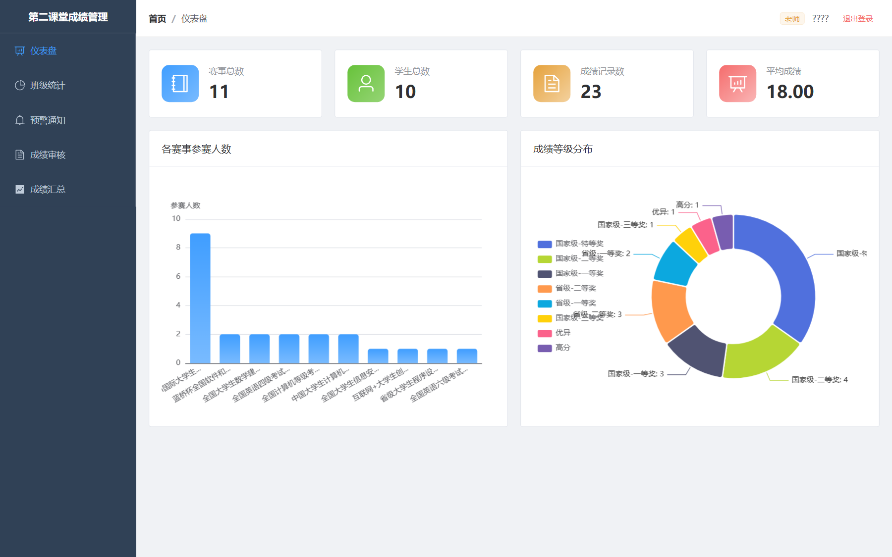 |
| *多角色入口* | *教师登录后首页* |

| **成绩审核（核心）** | 成绩汇总 |
|:---:|:---:|
|  |  |
| *待审核/已通过/未通过 + 通过拒绝按钮* | *多条件筛选 + 分页* |

| 班级统计分析 | 预警通知 |
|:---:|:---:|
|  | 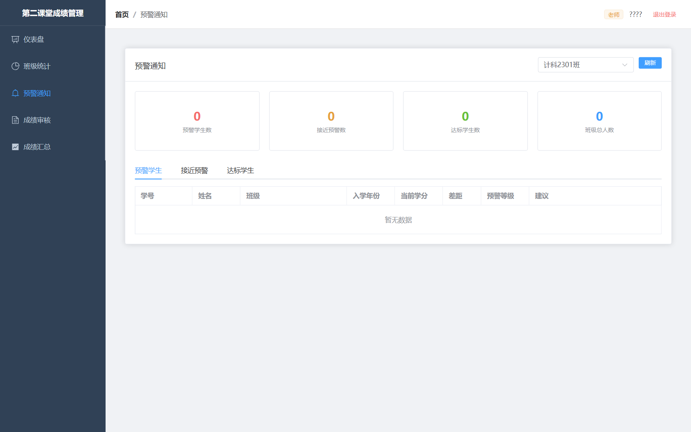 |
| *平均/最高/最低分 + 达标/预警人数* | *预警学生/接近预警/达标学生分类* |

---

### 🧑‍💼 管理员端

| 机构管理（树形结构） | 赛事管理 |
|:---:|:---:|
| 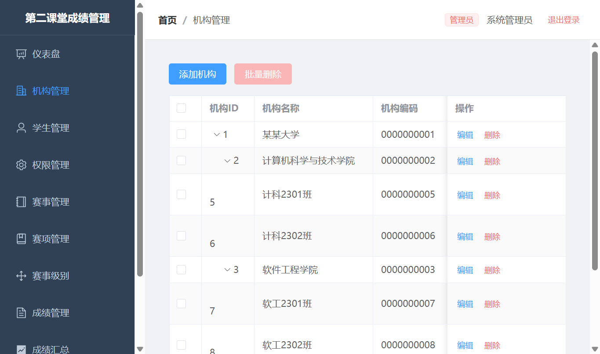 | 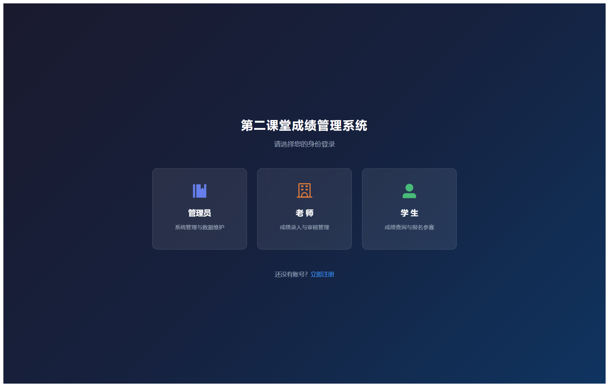 |
| *院系/专业/班级三层级联树* | *赛事/赛项/获奖级别 CRUD* |

---

### 🎓 学生端（Web 版 / 对应鸿蒙 App 同布局）

| 学生登录（移动端尺寸） | 首页仪表盘 |
|:---:|:---:|
| 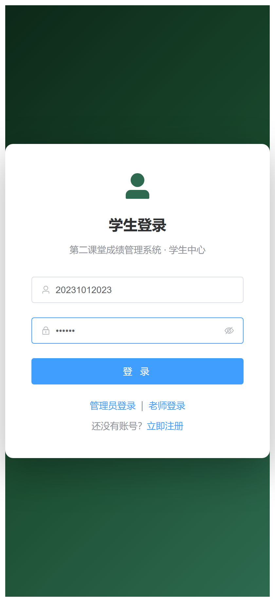 | 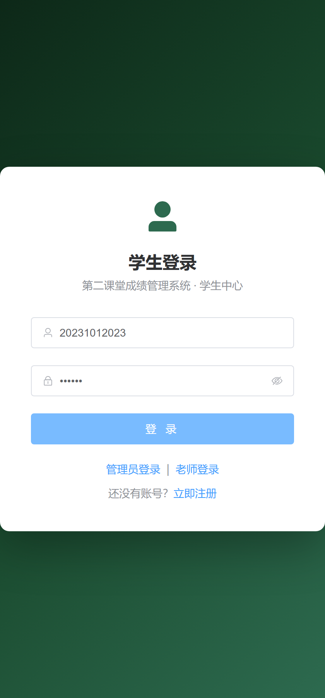 |
| *账号密码登录* | *总积分/赛事入口* |

| 学习计划 | 成绩填报 | 我的成绩 |
|:---:|:---:|:---:|
| 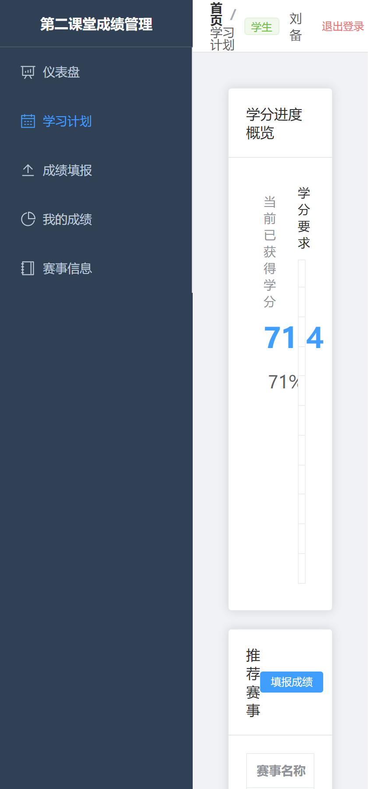 | 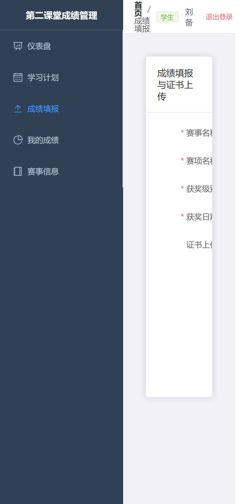 | 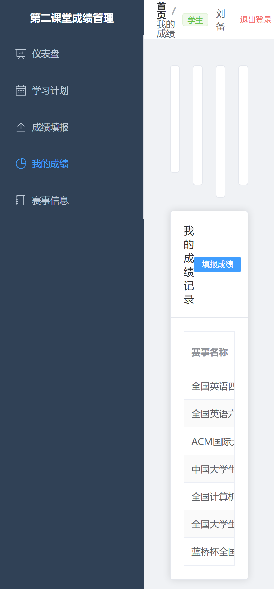 |
| *学分要求/赛事推荐* | *赛事+赛项+级别选择+证书上传* | *明细 + 审核状态实时展示* |

> 📌 截图脚本：[`docs/take_screenshots.py`](docs/take_screenshots.py)（Playwright 自动化截图）
> 📁 所有截图：[`docs/screenshots/`](docs/screenshots/)

---

### 📱 学生端（微信小程序 · 原生登录）

| 微信登录页 | 首页仪表盘 |
|:---:|:---:|
| 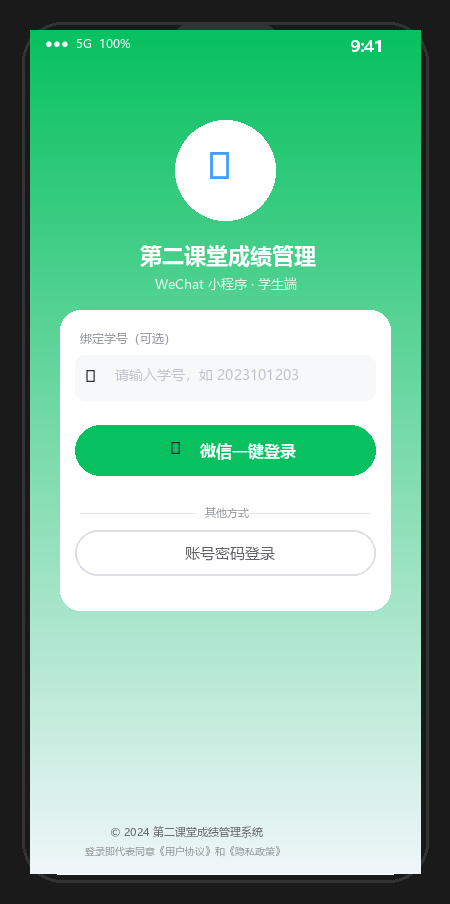 | 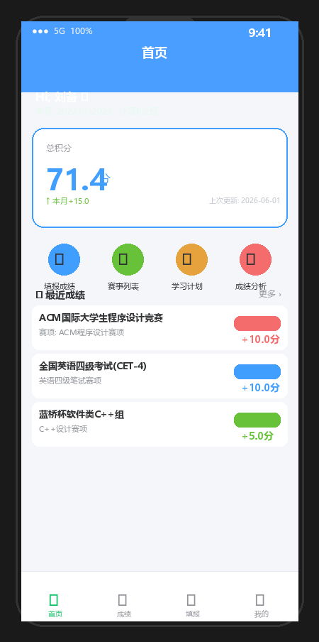 |
| *wx.login 原生一键登录* | *总积分/快捷入口/最近成绩* |

| 我的成绩 | 成绩填报 | 赛事列表 |
|:---:|:---:|:---:|
| 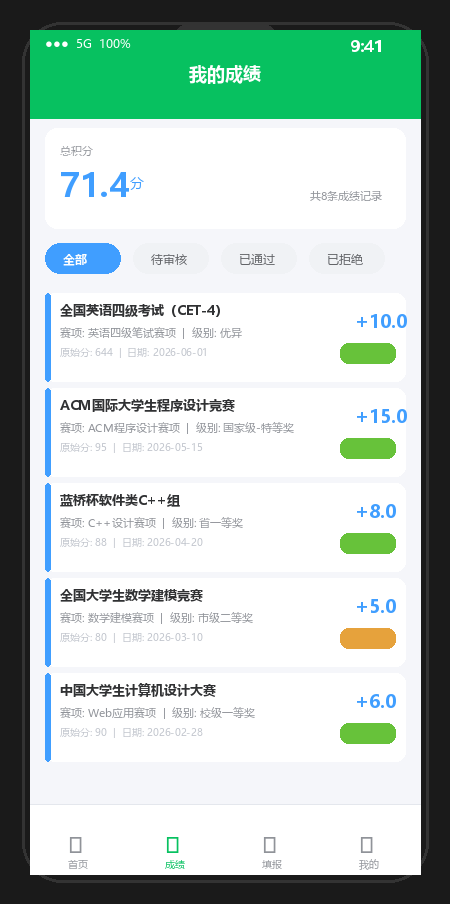 | 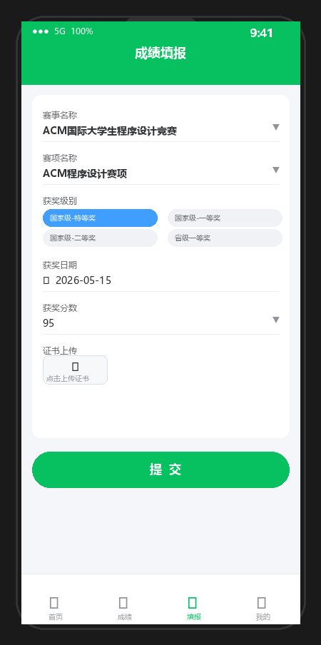 | 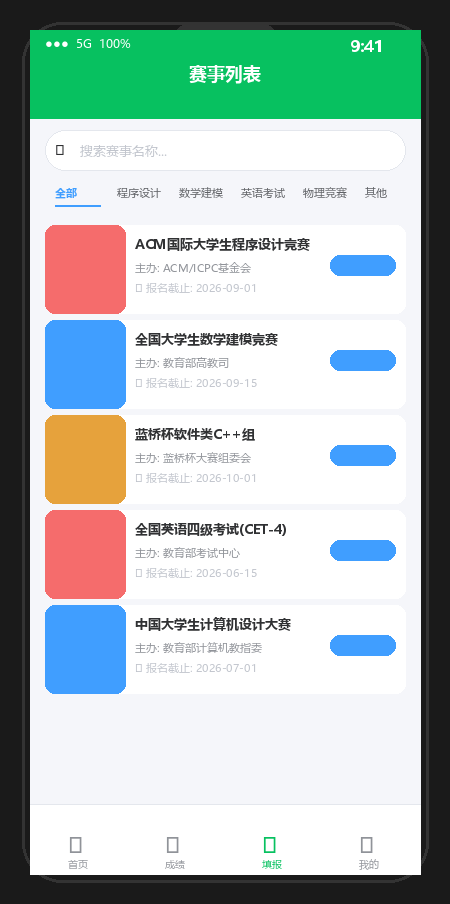 |
| *5条成绩明细 + 审核状态标签* | *赛事/赛项/级别三级联动+证书上传* | *搜索过滤 + 分类标签* |

| 学习计划 | 个人中心 |
|:---:|:---:|
| 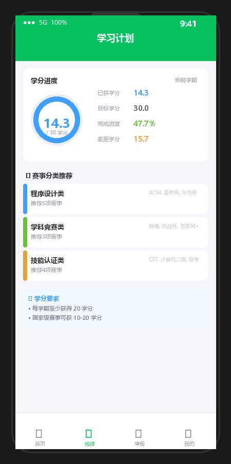 | 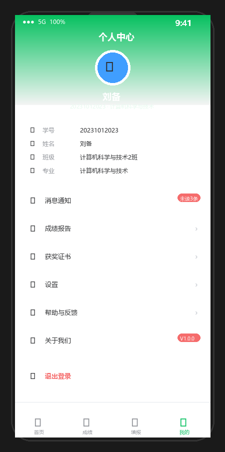 |
| *学分进度环形图 + 赛事推荐* | *用户信息 + 功能菜单* |

---

## 📁 项目结构

```
.
├── Hongmeng/                          # 后端服务（Spring Boot）
│   ├── src/main/java/edu/ynjgy/
│   │   ├── Controller/                # REST API 控制器
│   │   ├── Service/                   # 业务逻辑层
│   │   ├── Service/impl/              # 服务实现
│   │   ├── entity/                    # 数据库实体（Entity）
│   │   ├── mapper/                    # MyBatis Mapper 接口
│   │   ├── dto/                       # 请求/响应 DTO
│   │   ├── vo/                        # 视图 VO
│   │   └── utils/                     # 工具类（Result/PageResult）
│   └── src/main/resources/
│       └── application.yml            # 数据库配置
│
├── frontend-admin/                    # 教师/管理员后台（Vue3 + Vite）
│   ├── src/
│   │   ├── api/                       # axios 请求封装
│   │   ├── views/
│   │   │   ├── score/ScoreManageView.vue       # 成绩审核
│   │   │   ├── class/ClassStatsView.vue        # 班级统计
│   │   │   ├── warning/WarningsView.vue        # 预警通知
│   │   │   ├── org/OrgManageView.vue           # 机构管理
│   │   │   └── ...
│   │   ├── types/                    # TS 类型定义
│   │   ├── router/                   # 路由配置
│   │   └── App.vue
│   └── package.json
│
├── Hongmeng2/                         # 学生端鸿蒙应用
│   ├── entry/src/main/ets/
│   │   ├── pages/
│   │   │   ├── Login.ets              # 登录页
│   │   │   ├── Index.ets              # 首页/积分概览
│   │   │   ├── Score.ets              # 我的成绩
│   │   │   ├── ScoreSubmit.ets        # 成绩填报
│   │   │   └── StudyPlan.ets          # 学习计划
│   │   └── store/user.ets             # 用户状态 Preferences
│   └── build-profile.json5
│
├── tests/                             # ⭐ 自动化测试套件
│   ├── api/                           # 接口自动化（pytest + requests）
│   │   ├── test_auth.py               # 登录/注册
│   │   ├── test_score.py              # 成绩提交/审核/查询
│   │   ├── test_event.py              # 赛事/赛项/级别 CRUD
│   │   └── test_student_org.py        # 学生/机构管理
│   ├── ui/                            # UI自动化（Playwright）
│   │   ├── test_login_page.py
│   │   └── test_score_page.py
│   ├── common/                        # ApiClient + 断言工具
│   ├── conftest.py                    # pytest 全局 fixture
│   ├── pytest.ini                     # pytest 配置
│   ├── requirements-api.txt           # 接口测试依赖
│   ├── requirements-ui.txt            # UI测试依赖
│   └── README.md                      # 测试详细文档
│
└── .github/workflows/
    └── automated-tests.yml            # ⭐ GitHub Actions CI/CD 流水线
```

---

## 🚀 快速开始

### 环境要求
- **JDK 17+**
- **Node.js 18+**
- **MySQL 8.0+**
- **Maven 3.6+**（后端构建）
- **DevEco Studio**（鸿蒙应用编译，可选）

### 1. 启动后端（Spring Boot）

```bash
cd Hongmeng

# 1. 导入数据库（先创建数据库）
mysql -uroot -p < src/main/resources/db/schema.sql

# 2. 修改 application.yml 数据库账号密码
#    datasource: url / username / password

# 3. 编译并启动
mvn clean spring-boot:run

# 启动成功后访问：
#   API 基础地址: http://localhost:8080
#   健康检查:     GET http://localhost:8080/api/auth/login
```

### 2. 启动前端（Vue3 管理后台）

```bash
cd frontend-admin

# 1. 安装依赖
npm install
# 或（兼容旧依赖）
npm install --legacy-peer-deps

# 2. 启动开发服务器
npm run dev

# 浏览器访问：http://localhost:5173
# 默认登录账号见 application.yml 或数据库 user_info 表
```

### 3. 运行自动化测试

```bash
cd tests

# 安装依赖
pip install -r requirements-api.txt

# 运行接口测试 + 生成HTML报告
pytest api/ -v -s --html=reports/api_report.html --self-contained-html
```

详细测试使用文档：[`tests/README.md`](tests/README.md)

---

## 🔄 GitHub Actions CI/CD

代码推送或创建 Pull Request 时自动执行：

```
┌────────────────────────────────────────────────────────┐
│  Job 1: 接口自动化测试                                 │
│    • 启动 MySQL 8.0 容器                               │
│    • Maven 编译并运行 Spring Boot                       │
│    • pytest 运行全部接口测试（38+ 用例）                 │
│    • 上传 HTML + JUnit 报告到 Artifacts               │
├────────────────────────────────────────────────────────┤
│  Job 2: UI 自动化测试                                  │
│    • Playwright + Chromium 安装                         │
│    • npm run dev 启动前端服务                            │
│    • UI 测试（失败自动截图+录屏）                      │
│    • 上传 UI 报告 + 截图                                 │
├────────────────────────────────────────────────────────┤
│  Job 3: 结果汇总（解析 XML，统计用例数/失败数）        │
└────────────────────────────────────────────────────────┘
```

手动触发：**GitHub → Actions → 自动化测试 CI → Run workflow**

---

## 📊 接口测试用例覆盖率

| 模块 | 用例数 | 说明 |
|------|--------|------|
| 用户认证 | 9 | 正常登录（学生/教师）、用户名不存在、密码错误、空值校验、注册 |
| 成绩管理 | 16 | 提交/缺失字段、审核通过/拒绝、分页查询、筛选、班级统计 |
| 赛事管理 | 13 | 赛事增删改查、赛项查询、获奖级别 CRUD |
| 学生+机构 | 11 | 学生信息 CRUD、机构树、新增/删除 |
| **合计** | **49+** | |

UI 测试：登录页 + 成绩审核页 + 统计页 + 预警页（自动截图）

---

## 🚀 并发压测实测结果（本机 100 线程）

> 详细报告 & 压测体系文档：[`tests/AUTOMATED_TESTING_README.md`](tests/AUTOMATED_TESTING_README.md)

```
======================================================================
  🚀 Python 多线程并发基准测试  |  100 线程 × 4接口 = 400 请求
======================================================================
  总耗时:            0.59 秒
  总请求数:          400
  ✅ 成功:           400    (100% 成功率)
  ❌ 失败:           0
  整体 QPS:          674.72 req/s
----------------------------------------------------------------------
  · 机构树 (org_tree)           avg= 139ms    P95= 243ms
  · 成绩列表分页 (score_list)   avg= 316ms    P95= 410ms
  · 学生我的成绩 (my_scores)    avg=  10ms    P95=  28ms
  · 赛事全量 (event_all)        avg=   9ms    P95=  24ms
======================================================================
```

### 压测实现方案
| 方案 | 技术 | 适用场景 | 文件 |
|------|------|----------|------|
| **线程基准压测** | Python threading + requests.Session（连接池） | 100~1000 并发快速出 QPS/P95 | [`test_parallel_stress.py`](tests/performance/test_parallel_stress.py) |
| **专业动态压测** | Locust（加权三角色场景） | 动态用户数、实时图表、CSV/HTML报告 | [`locustfile.py`](tests/performance/locustfile.py) |
| **多进程并发用例** | pytest-xdist + pytest-repeat | 并发写正确性验证 | 同上 + `pytest -n 8 --count 50` |

---

## 🧩 主要技术栈亮点

- **MyBatis 动态 SQL**：`<if>` `<foreach>` 支持多条件分页查询、批量操作
- **审核状态流转**：`audit_status` 0(待审核)→1(通过)/2(拒绝)，通过后自动计入总分
- **鸿蒙底部弹窗**：`Stack + if` 条件渲染实现赛事/赛项/获奖级别滑动选择
- **Preferences 登录态**：鸿蒙端本地持久化用户状态，离线仍可浏览历史数据
- **机构树形结构**：后端递归组装 children，前端 Element Plus 树形表格
- **pytest + Playwright**：接口+UI双维度自动化，GitHub Actions 每提交自动跑

---

## 📄 相关文档

| 文档 | 路径 |
|------|------|
| 自动化测试详细文档 | [`tests/README.md`](tests/README.md) |
| 软件测试文档（Word） | [`软件测试文档.docx`](软件测试文档.docx) |
| API接口文档（Word） | 项目根目录 `.docx` 文件 |
| 项目说明文档（Word） | 项目根目录 `.docx` 文件 |

---

## 📝 License

MIT License - 仅供学习、毕业设计与面试展示使用。
